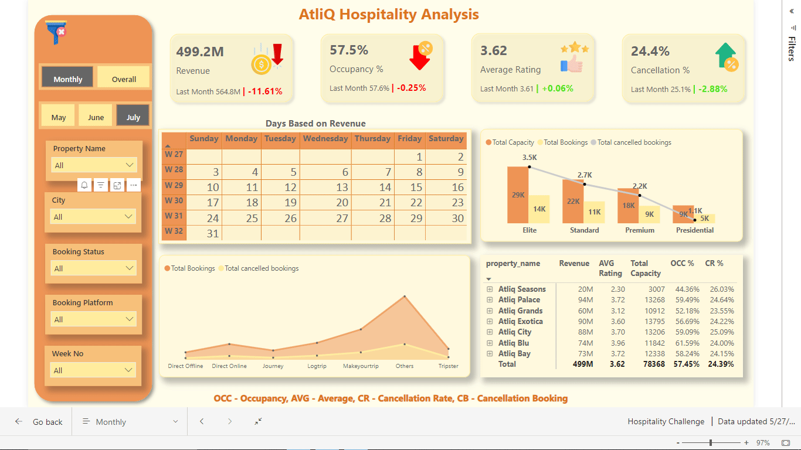
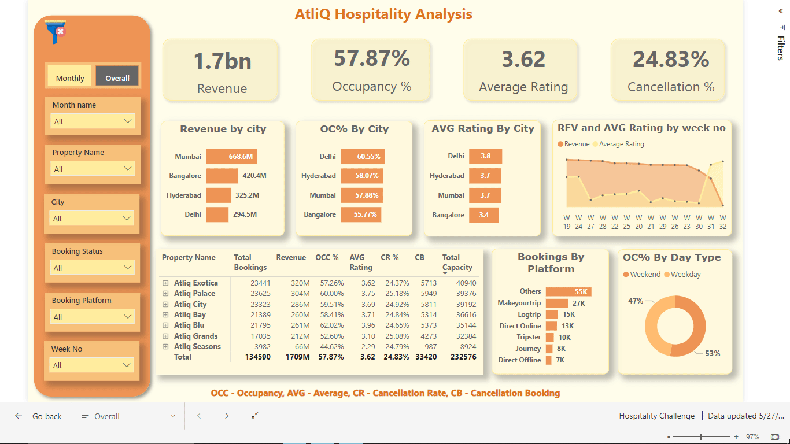

# AtliQ Hospitality Analysis - PowerBI

## Project Overview

This project focuses on a comprehensive analysis of the hospitality sector for Atliq Grands. The objective was to provide data-driven insights to guide strategic decisions and improve performance in response to declining market share and revenue.

-link to the [Interactive Dashboard](https://app.powerbi.com/view?r=eyJrIjoiNmQxNDBmMGYtOWM2Ni00ZjYyLWFiNjgtNTZhOWYyYjM4MWI1IiwidCI6ImM2ZTU0OWIzLTVmNDUtNDAzMi1hYWU5LWQ0MjQ0ZGM1YjJjNCJ9).

## Problem Statement

Atliq Grands, a renowned name in the luxury hotel industry in India, has been facing a decline in market share and revenue due to strategic moves by competitors and ineffective decision-making. To counter this, the management decided to leverage Business and Data Intelligence but lacked an in-house analytics team. Consequently, they sought insights from their historical data to guide their strategies and improve performance.

## Monthly View

## Overall View

---
## Key Learnings

1. **Custom Visual Creation**: Developed a Calendar visual using a matrix table.
2. **Cancellation Policies**: Insights into industry-standard cancellation policies.
3. **Bookmarks and Selection**: Enhanced functionality with bookmarks for navigation.
4. **Consistent Color Palette**: Maintained visual consistency across the dashboard.
5. **RevPAR**: Calculated Revenue Per Available Room.
6. **Realisation %**: Measured the successful "checked out" percentage.
7. **ADR**: Computed the Average Daily Rate.
8. **DSRN**: Calculated Daily Sellable Room Nights.

---

## Significant Insights from the Dashboard

1. **Revenue Generation**:
   - Mumbai: Top revenue generator with 669 Million.
   - AtliQ Exotica: Leads with 320 Million in revenue, an average rating of 3.62, occupancy rate of 57%, and a cancellation rate of 24.4%.
   - Week 24: Peak revenue week at 139.6 Million.
   
2. **Occupancy and Performance**:
   - AtliQ Bay: Highest occupancy rate at 66%.
   - Delhi: Excels in both occupancy and ratings, followed by Hyderabad, Mumbai, and Bangalore.

3. **Cancellation Impact**:
   - Revenue loss: Approximately 298 Million due to cancellations.
   - Elite rooms: Highest booking and cancellation rates.

4. **Room Type Analysis**:
   - Premium rooms: High booking frequency but notable cancellation trend.
   
5. **Revenue Trends**:
   - Seasonal trends: Peak booking periods align with major holidays and business events.

6. **Customer Demographics**:
   - High percentage of repeat customers in Mumbai and Bangalore, highlighting the importance of loyalty programs.

---

## Conclusion

This analysis provided Atliq Grands with critical insights into their revenue, occupancy rates, and cancellation impacts. The recommendations and data-driven decisions derived from this project aim to improve their market position and overall performance.
